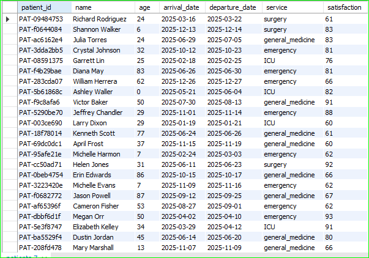
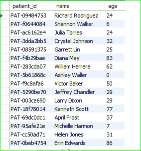
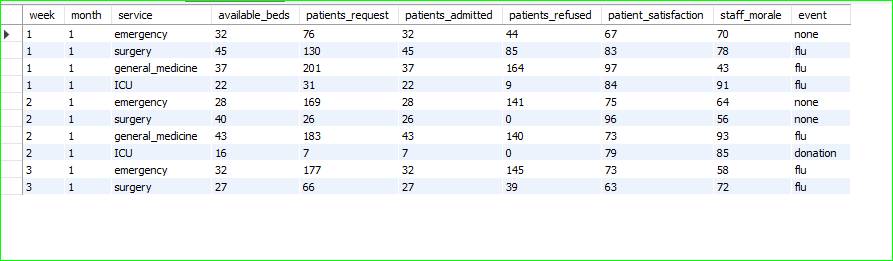
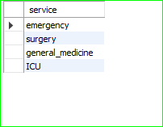

### Practice Questions:

#1. Retrieve all columns from the `patients` table.
select * from patients;

#2. Select only the `patient_id`, `name`, and `age` columns from the `patients` table.
select patient_id, name, age from patients;

#3. Display the first 10 records from the `services_weekly` table.
select * from services_weekly limit 10;

### Daily Challenge:

# List all unique hospital services available in the hospital.
select distinct(service) from services_weekly;

