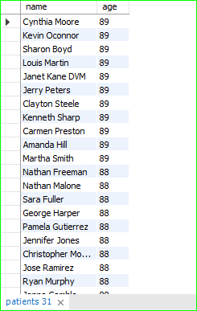
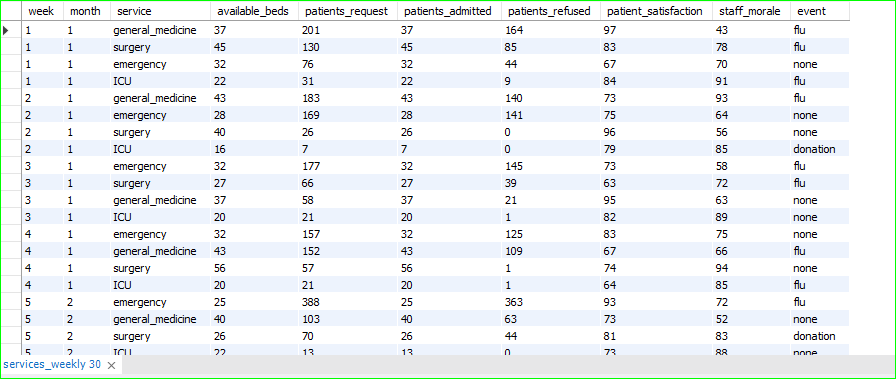
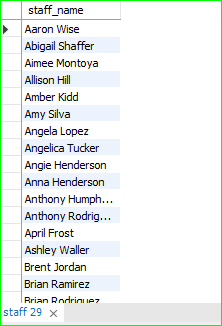
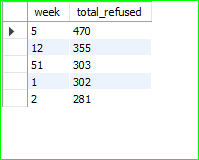

### Practice Questions:

# 1. List all patients sorted by age in descending order.

select name, age from patients 
order by age desc;

# 2. Show all services_weekly data sorted by week number ascending and patients_request descending.

select * from services_weekly
order by week asc, patients_request desc;

# 3. Display staff members sorted alphabetically by their names.

select staff_name from staff
order by staff_name;

# Question: Retrieve the top 5 weeks with the highest patient refusals across all services, 
# showing week, service, patients_refused, and patients_request. Sort by patients_refused in descending order.

SELECT week,
       SUM(patients_refused) AS total_refused
FROM services_weekly
GROUP BY week
ORDER BY total_refused DESC
LIMIT 5; 

